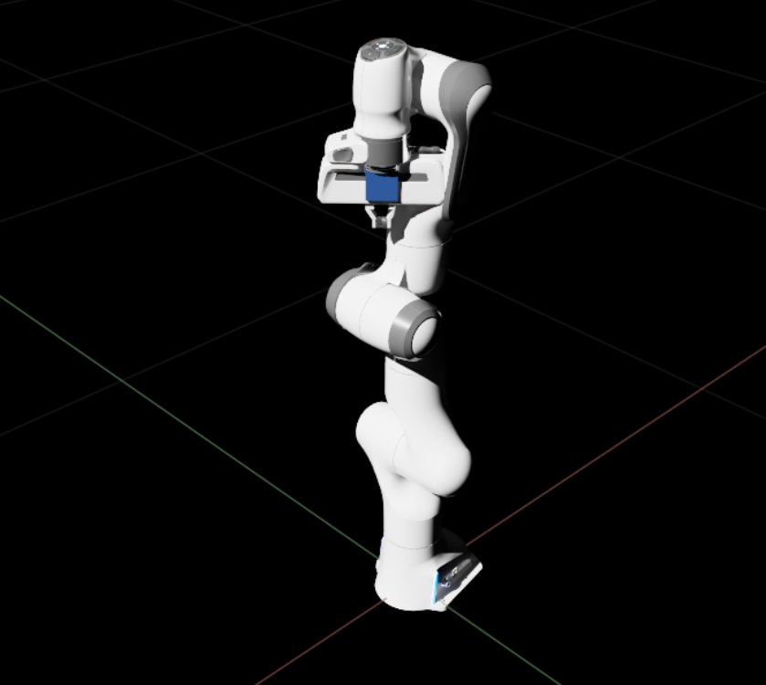
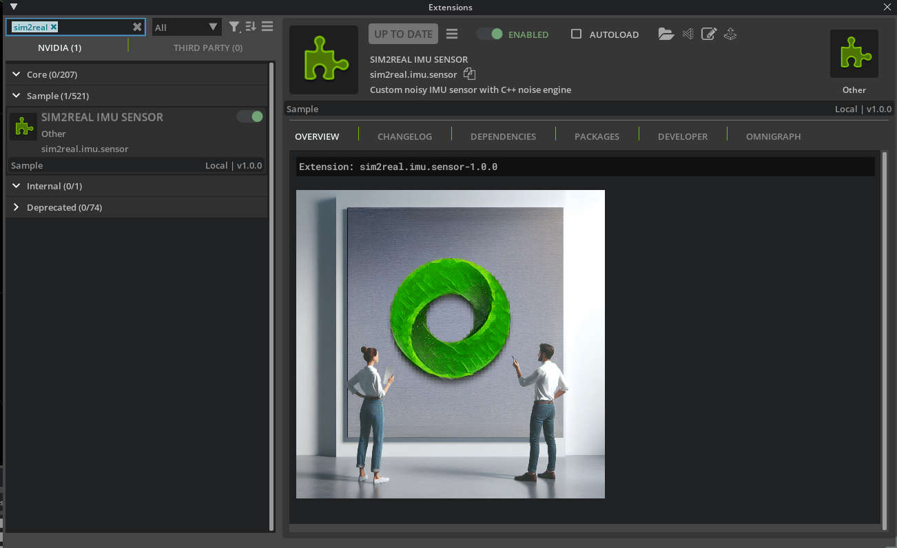
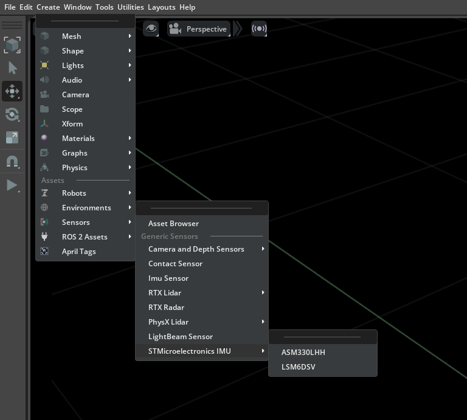
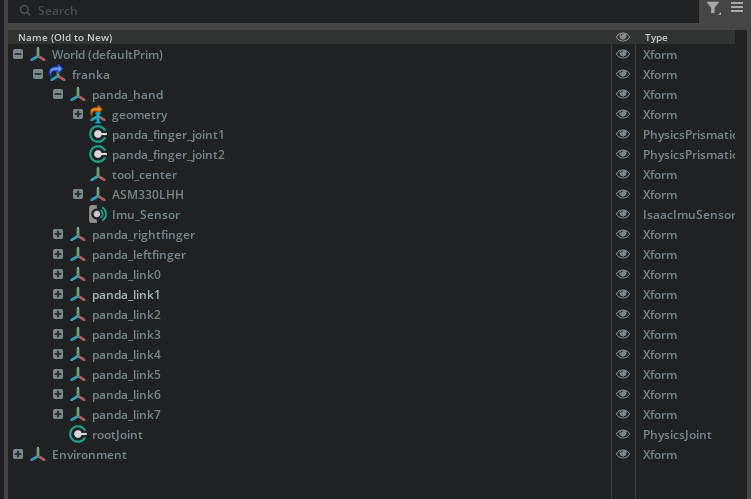
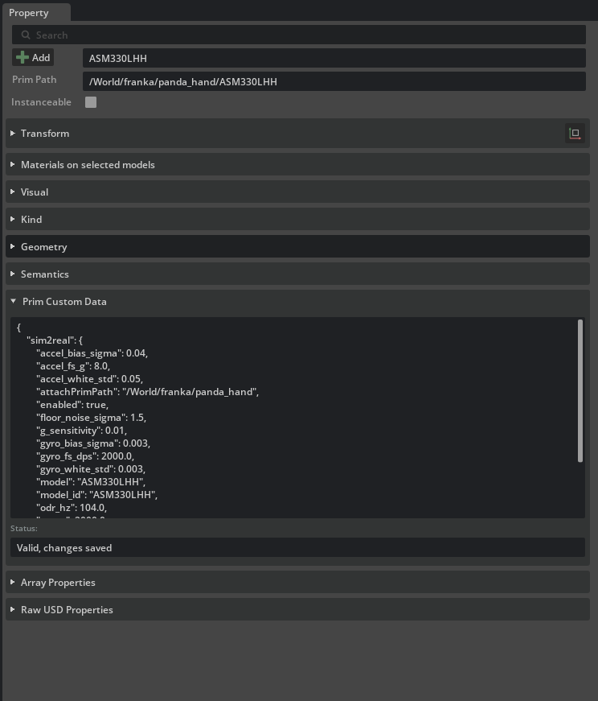
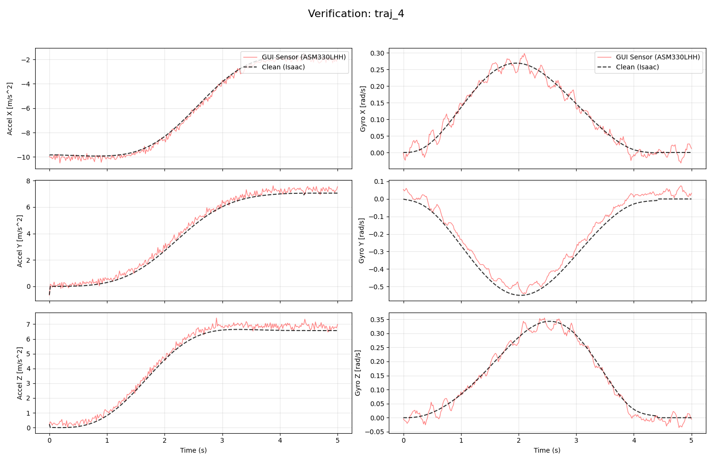

# Custom Isaac Sim IMU Sensor — STMicroelectronics Extension

A custom **Isaac Sim 5.0** extension that adds STMicroelectronics IMU sensor models directly into the `Create → Sensors` menu. Spawns a physics-driven, noise-augmented IMU prim with a visible viewport marker, backed by a C++ noise engine via pybind11.



**Supported sensor models:**
- ASM330LHH
- LSM6DSV

---

## Features

- ✅ Native Isaac Sim menu integration — no scripting required to place sensors
- ✅ Auto-attaches to whichever prim is selected in the Stage panel
- ✅ Visible dark navy cube marker in the viewport
- ✅ Physics-step driven runtime ticks each IMU at its configured ODR, independent of render rate
- ✅ Realistic noise model: white noise + Gauss-Markov bias drift + structural vibration
- ✅ Per-model JSON configs — tune noise without touching code
- ✅ Verified against clean Isaac IMU output via included verification scripts

---

## Requirements

- **Ubuntu 22.04** (tested)
- **Isaac Sim Full 5.0.0** — [Installation Guide](https://docs.isaacsim.omniverse.nvidia.com/latest/installation/install_workstation.html)
- **Python 3.10** (bundled with Isaac Sim)
- The compiled **C++ noise engine**: `sim2real_native_v0_1.so`
  - This is a platform-specific binary. Contact the maintainer to obtain the correct build.
  - Must be compiled for Python 3.10 on Linux x86_64.

---

## Repository Structure

```
Custom-IsaacSim-Sensor/
  config/
    extension.toml              # Extension metadata and dependencies
  data/
    models/
      ASM330LHH.json            # ASM330LHH noise profile and hardware config
      LSM6DSV.json              # LSM6DSV noise profile and hardware config
  sim2real/
    imu/
      sensor/
        __init__.py
        extension.py            # Menu registration, prim spawning
        config.py               # JSON config loader
        runtime.py              # Physics-step subscription + ODR scheduler
        noise/
          __init__.py
          native_backend.py     # C++ pybind wrapper
  imgs/                         # Screenshots for this README
  verification_script.py        # Trajectory logging script
  plot_verification.py          # Plot generator
  README.md
```

---

## Installation

### Step 1 — Clone the repository

```bash
git clone https://github.com/rsonawane2002/Custom-IsaacSim-Sensor.git
cd Custom-IsaacSim-Sensor
```

### Step 2 — Place the extension in your Isaac Sim extensions folder

Copy the repo contents into your Isaac Sim extensions directory:

```bash
cp -r . /path/to/isaac-sim/exts/sim2real.imu.sensor/
```

> The destination folder must be registered as an extension search path in Isaac Sim.
> To check or add paths: **Window → Extensions → ⚙️ (gear icon) → Extension Search Paths**

### Step 3 — Update the C++ engine path

Open `sim2real/imu/sensor/noise/native_backend.py` and update this line to point to the folder containing your `.so` file:

```python
COMPILED_CODE_PATH = "/home/<your-username>/Downloads"
```

### Step 4 — Enable the extension

1. Launch Isaac Sim
2. Go to **Window → Extensions**
3. Search for `sim2real`
4. Toggle **Sim2Real IMU Sensor** on



5. Check the console for:

```
[Sim2Real IMU] Native C++ backend loaded successfully.
[Sim2Real IMU] Physics step subscription active.
```

6. *(Optional)* Check **AUTOLOAD** to enable automatically on every launch.

---

## Usage

### Placing a Sensor

1. Load a robot into your scene
2. In the **Stage** panel, click the link you want to attach the sensor to (e.g. `panda_hand`)
3. From the top menu: `Create → Sensors → STMicroelectronics IMU → ASM330LHH`



4. The sensor appears as a child prim of your selected link with a navy cube visible in the viewport



5. Select the IMU prim and inspect **Properties** to confirm the config was applied



6. Press **Play** — the noise engine ticks automatically at the sensor's configured ODR

---

## Sensor Configuration

Each model's noise profile lives in `data/models/<model>.json`. Edit these files to tune the sensor — **no code changes required**.

```json
{
    "model_id": "ASM330LHH",
    "accel_fs_g": 8.0,
    "gyro_fs_dps": 2000.0,
    "odr_hz": 104.0,
    "vibration": true,
    "accel_white_std": 0.05,
    "gyro_white_std": 0.003,
    "floor_noise_sigma": 1.5,
    "g_sensitivity": 0.01,
    "tau_a": 2000.0,
    "tau_g": 2000.0,
    "accel_bias_sigma": 0.04,
    "gyro_bias_sigma": 0.003
}
```

| Parameter | Description |
|---|---|
| `accel_fs_g` | Accelerometer full-scale range (g) |
| `gyro_fs_dps` | Gyroscope full-scale range (deg/s) |
| `odr_hz` | Output data rate (Hz) |
| `vibration` | Enable structural vibration model |
| `accel_white_std` | Accelerometer white noise std (m/s²) |
| `gyro_white_std` | Gyroscope white noise std (rad/s) |
| `floor_noise_sigma` | Vibration floor noise amplitude |
| `g_sensitivity` | Gyro sensitivity to vibration |
| `tau_a` | Accelerometer bias time constant (s) — higher = slower drift |
| `tau_g` | Gyroscope bias time constant (s) — higher = slower drift |
| `accel_bias_sigma` | Accelerometer bias diffusion magnitude |
| `gyro_bias_sigma` | Gyroscope bias diffusion magnitude |

> Config changes take effect the next time you place a sensor. Delete and re-place the prim to apply new values.

### Adding a New Sensor Model

1. Create `data/models/<NewModel>.json` with the hardware specs
2. Add one entry to the submenu in `extension.py`:
```python
MenuItemDescription(
    name="NewModel",
    onclick_fn=lambda: self._spawn_imu(model="NewModel"),
),
```
3. Toggle the extension off and on

---

## Verification

Included scripts let you validate the noise pipeline against clean Isaac IMU output.

### Run the verification script

1. Load a stage with a Franka robot
2. Select `panda_hand` in the Stage panel and place an ASM330LHH sensor via the menu
3. Open **Window → Script Editor**
4. Paste and run `verification_script.py`
5. Press **Play** — 5 trajectories log automatically to `~/Documents/trajectories_verification/`

### Generate plots

```bash
python3 plot_verification.py
```

Each `traj_N/` folder gets a `verification_plot.png` showing clean vs noisy IMU output across all 6 axes:



The noisy trace (red) should follow the clean motion profile (black dashed) with visible noise and bias drift on top.

---

## Troubleshooting

**Extension not found in manager**
```bash
find /path/to/exts/sim2real.imu.sensor -type f
```
Confirm all files are present including `noise/__init__.py`.

**C++ backend fails to load**
- Verify `COMPILED_CODE_PATH` in `native_backend.py` points to the folder containing `sim2real_native_v0_1.so`
- Confirm the `.so` was compiled for Python 3.10

**Menu shows but cube is not visible in viewport**
- Toggle the extension off and on
- Check the console for Python errors
- Run this in the Script Editor to confirm the prim exists:
```python
import omni.usd
stage = omni.usd.get_context().get_stage()
prim = stage.GetPrimAtPath("/World/franka/panda_hand/ASM330LHH/visual")
print("Visual prim exists:", prim.IsValid())
```

**Noise profile looks too clean or too aggressive**
- Edit `data/models/ASM330LHH.json` directly
- Delete and re-place the sensor prim to pick up the new values
- Rerun `verification_script.py` and `plot_verification.py` to verify

---

## Tested On

| Component | Version |
|---|---|
| Isaac Sim | 5.0.0 |
| Ubuntu | 22.04 |
| Python | 3.10 |
| GPU | NVIDIA GeForce RTX 3060 |
